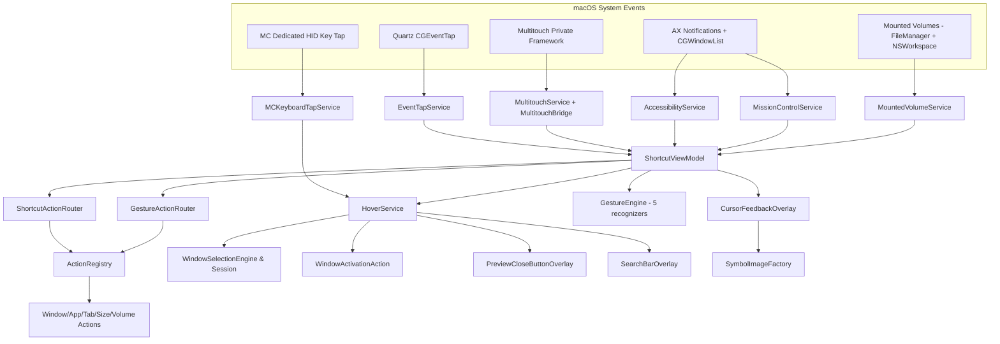
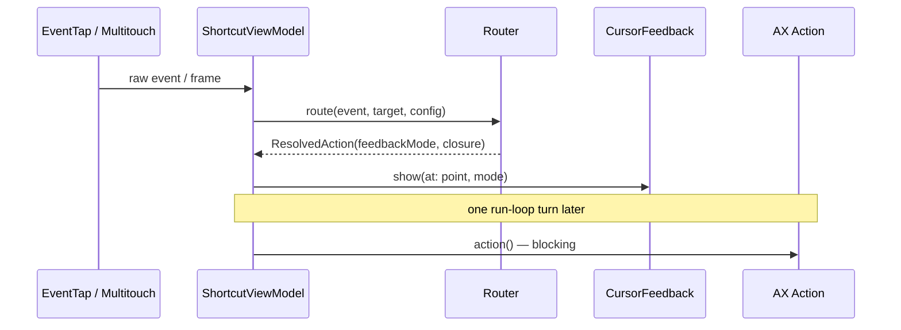
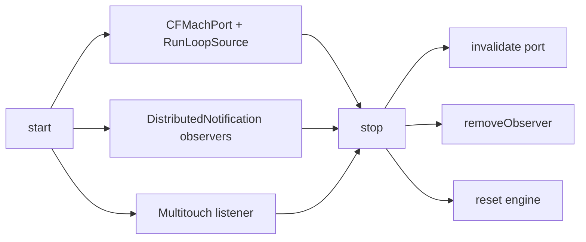

# MCSC Architecture & Engineering Deep Dive

This document serves as an educational resource and architectural blueprint for **MCSC (Mac Shortcut Control)**. It explains the design decisions, structural patterns, and performance optimizations behind the codebase.

---

## 🏛 The Core Dilemma: AppKit vs. SwiftUI

One of the most foundational architectural choices in MCSC was committing to a pure AppKit / Core Foundation foundation rather than SwiftUI.

| Feature | SwiftUI | AppKit (Current) |
| :--- | :--- | :--- |
| **Baseline Memory** | ~16-25 MB | **~12.4 MB** |
| **Framework Overhead** | High (SwiftUI Runtime, Combine) | Minimal |
| **Control** | Declarative (Abstracted) | Imperative (Granular) |
| **Lifecycle** | Managed by `@main` | Managed via `main.swift` & `AppDelegate` |

**Memory Footprint:** For a background utility that lives in the menu bar and processes trackpad/keyboard events, SwiftUI's runtime introduces unnecessary allocations. By using `main.swift`, `NSApplication`, and lightweight Cocoa panels, MCSC maintains a baseline memory footprint under 13 MB.

> **Extended comparison:**

| Dimension | SwiftUI | **AppKit (MCSC)** |
|-----------|---------|-------------------|
| Panels | `WindowGroup` | Lightweight `NSPanel` (non-activating) |
| Event tap | Via workarounds | Direct `CGEvent.tapCreate` |

See `MCSC/App/main.swift` and `PERFORMANCE.md` for measurement details.

---

## 🏗 Modular MVVM Architecture

MCSC strictly follows the **Model-View-ViewModel (MVVM)** pattern with protocol-driven dependency inversion and clear single-responsibility components:

```
[System Events: Quartz CGEventTap / Multitouch / AX Notifications]
                           │
                           ▼
                    [Services Layer]
  (AccessibilityService, EventTapService, MultitouchService, MissionControlService)
                           │
                           ▼
                   [ViewModel Layer]
  (ShortcutViewModel ──► ShortcutActionRouter & GestureActionRouter)
                           │
             ┌─────────────┴─────────────┐
              ▼                           ▼
       [Actions (Models)]          [Views (Overlays)]
  (WindowActions/*, AppActions,   (CursorFeedbackOverlay,
   TabActions, VolumeActions)      PreviewCloseButtonOverlay)
```

### 1. Models (`MCSC/Models`)
 - **Unified Close Flow:** `WindowCloser` (`Models/Actions/WindowCloser.swift`) — single stateless entry point for the close family, scoped by `CloseScope` (`.activeTab` / `.allTabs` / `.window` / `.wholeApp`). A non-nil `fromApp` means a Dock trigger (key window or full window list); otherwise the hovered window under the cursor is resolved. Dock-triggered `.wholeApp` with zero windows is a no-op (never terminates).
 - **Single-Responsibility Structs:** `MinimizeWindowAction`, `HideApplicationAction`, `ForceQuitAction`, `MinimizeAppAction`, `ForceQuitAppAction`, `ReopenTabAction`, `NewWindowAction`, `FillScreenAction`, `MakeLargerAction`, `MakeSmallerAction`, `ReasonableSizeAction`, `AlmostMaximizeAction`, `EjectVolumeAction` (closes an ejectable Finder window via `kAXCloseButtonAttribute` then ejects via `MountedVolumeService`) — window actions live in `Models/Actions/WindowActions/` (`WindowControlActions.swift` + `SizeActions.swift` + `DesktopNavigationActions.swift`).
- **Fuzzy Finder Models:**
  - `WindowSelectionEngine`: Pure, stateless fuzzy search ranking prefix matches over substring matches and resolving top-left thumbnail shoulder coordinates.
  - `WindowSearchSession`: Side-effect-free keyboard session state machine tracking queries, selected index, match cycling, and modifier pass-through.
- **Mission Control Window Actions:**
  - `WindowActivationAction`: Injects synthetic `.mouseMoved` to paint Mission Control's native highlight and `.leftMouseDown` → 50 ms dwell → `.leftMouseUp` at `.cghidEventTap` to reliably activate thumbnails.
  - `MissionControlWindowActions`: Encapsulates window button pressing (`kAXCloseButtonAttribute`, `kAXMinimizeButtonAttribute`, `kAXZoomButtonAttribute`) and `CoreDockSendNotification` wake mechanisms.
- **Pure Helpers:** `KeyboardEventPoster` (C-level Quartz event injection), `ScreenGeometry` (coordinate conversions between Quartz AX space and Cocoa screen space).
- **Recognizers:** Gesture engines (`PinchInRecognizer`, `SwipeRecognizer`, `TwoFingerSwipeLeftRecognizer`, `TwoFingerSwipeRightRecognizer`, `TwoFingerDoubleTapRecognizer`) evaluating multitouch frames against geometric thresholds.

### 2. ViewModels (`MCSC/ViewModels`)
- **`ShortcutViewModel`:** Lifecycle orchestrator that instantiates and connects services, manages user configuration, and coordinates overlay feedback before action execution. Lazily owns `MountedVolumeService` and passes it to both routers.
- **`ShortcutActionRouter`:** Pure router mapping keyboard events (`Cmd+W`, `Cmd+Q`, `Cmd+M`, `Cmd+H`) to concrete actions; `Cmd+W`/`Cmd+Q` on an ejectable Finder volume window route to `EjectVolumeAction` (`.eject` feedback) when `isAutoEjectEnabled` is true.
- **`GestureActionRouter`:** Pure router mapping recognized multitouch gestures to actions based on target resolution (dock vs. window); pinch-in (`pinchIn`/`cmdPinchIn`) and swipe-left (`.closeTab` path) on an ejectable Finder volume window route to `EjectVolumeAction` (`.eject`).
- **`ActionRegistry`:** Container holding shared instances of all actions to eliminate runtime heap allocations (includes `ejectVolumeAction`).
- **`ShortcutConfiguration`:** Pure data struct holding toggle states for all shortcuts and gestures, including `isAutoEjectEnabled` (default `true`, toggled via menu bar).

### 3. Services (`MCSC/Services`)
- **`AccessibilityServiceProtocol` / `AccessibilityService`:** Low-level wrapper for `AXUIElement` APIs with cached system-wide elements and safe CoreFoundation type checking. Exposes `getDocumentPath(for:)` (`kAXDocumentAttribute`) and `getWindowTitle(for:)` (`kAXTitleAttribute`) for volume-eject targeting.
- **`EventTapServiceProtocol` / `EventTapService`:** C-level Quartz event tap (`CGEvent.tapCreate`) for intercepting keyboard shortcuts.
- **`MCKeyboardTapServiceProtocol` / `MCKeyboardTapService`:** Dedicated `.cghidEventTap` `keyDown` tap active exclusively while Mission Control is open, ensuring alphanumeric key events are captured before WindowServer swallows them.
- **`MissionControlServiceProtocol` / `MissionControlService`:** Dual-mode detection (Dock notifications + cached window list scans) for Mission Control activation state.
- **`MultitouchService` & `MultitouchBridge`:** Private MultitouchSupport.framework dynamic loader and frame listener with wake/sleep lifecycle management.
- **`MissionControlHoverServiceProtocol` / `MissionControlHoverService`:** Tracks mouse movement in Mission Control, positions hover action buttons on active window previews, and orchestrates the keyboard fuzzy-finder session.
- **`MountedVolumeServiceProtocol` / `MountedVolumeService` (`Services/Volume`):** Lightweight on-demand volume detector — enumerates `FileManager.mountedVolumeURLs` with `volumeIsEjectable`/`volumeIsRemovable` and matches by document path (`/Volumes/...` prefix) or window title; ejects via `NSWorkspace.unmountAndEjectDevice(at:)` on a background queue. Zero heap allocations at idle, no persistent caches.
- **`AppLogger`:** Zero-allocation logging using Apple's unified `os.Logger` framework (`volume` category for eject success/failure).

#### Visual — System Map (Mermaid)



#### Detail Tables (supplement to the lists above)

| ViewModel Component | Testability |
|---|---|
| `ShortcutActionRouter` | Pure: `flags + TargetResolution + config` → `ResolvedShortcutAction` |
| `GestureActionRouter` | Pure: `GestureResult + target` → `feedbackMode + action` |
| `ActionRegistry` | One shared `struct` instance each — zero per-event alloc |



| Service | Cleanup |
|---------|---------|
| `EventTapService` | `stop()` invalidates `CFMachPort` |
| `MissionControlService` | `stop()` removes `DistributedNotificationCenter` observers, clears 200 ms cache |
| `MultitouchService` | `stop()` + sleep/wake handling |

### 4. Views (`MCSC/Views`)
- **`CursorFeedbackOverlay`:** Floating non-activating Cocoa panel that renders animated SF Symbols under the cursor.
- **`CursorFeedbackMode`:** Data-driven enumeration of visual feedback descriptors, accessibility labels, and tint palettes.
- **`PreviewCloseButtonOverlay`:** Floating close/action button rendered directly on hovered Mission Control previews.
- **`SymbolImageFactory`:** Cached SF Symbol generator configuring point sizes, variable color palettes, and weights.

---

## 🛠 System-Level Integration & Memory Best Practices

1. **Unmanaged Core Foundation Memory:** When dealing with C-level objects (`CGEvent`, `AXUIElement`, `CFMachPort`), we use `Unmanaged.passUnretained` unless explicit ownership transfer is required.
2. **Safe Core Foundation Downcasting:** All `CFTypeRef` downcasts verify `CFGetTypeID(ref) == AXUIElementGetTypeID()` (or corresponding type ID) before force-casting to eliminate runtime invalid pointer dereferences.
3. **No Retain Cycles:** All closures capture `[weak self]` or weak references to dependencies.
4. **Explicit Teardown:** Every service implements `start()` and `stop()` to invalidate run loop sources, remove notification observers, and tear down Mach ports.
5. **No Polling:** System event-driven architecture using event taps, observers, and multitouch frame callbacks without high-frequency polling timers.

#### Visual — Lifecycle & Memory Rules

| Rule | File |
|------|------|
| `Unmanaged.passUnretained` unless ownership | Services |
| `CFGetTypeID == AXUIElementGetTypeID()` before cast | `AccessibilityService.swift` |
| `[weak self]` in closures | `ShortcutViewModel.swift:78-216` |
| `lazy var` services | `ShortcutViewModel.swift:20-32` |
| `DispatchQueue.main.async { action() }` after feedback | `ShortcutViewModel.swift:212` |


