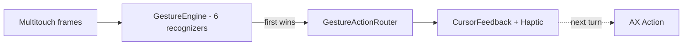
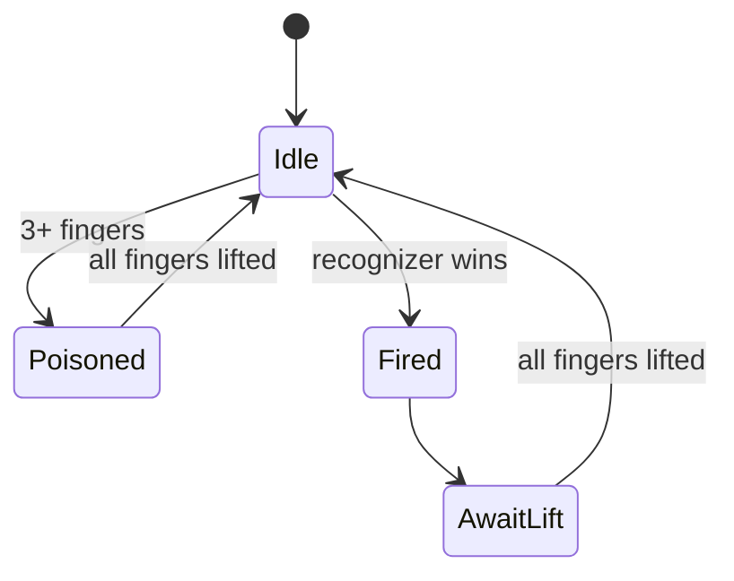

# Trackpad gestures

This document lists every trackpad gesture MCSC recognizes inside Mission
Control and the action each one triggers. For keyboard shortcuts and the hover
buttons, see [SHORTCUTS.md](./SHORTCUTS.md). For the symbol language used in
feedback overlays, see [SYMBOLS.md](./SYMBOLS.md).

Like the shortcuts, every gesture is **scoped to Mission Control only** and
stays silent on the desktop, in Launchpad, and in Finder folder stacks. The
detection heuristic is described in [ARCHITECTURE.md](./ARCHITECTURE.md).

---

## How the gestures work

Raw multitouch frames arrive from `MultitouchService` and are handed to a
`GestureEngine`, which runs a small set of recognizers in registration order.
The first recognizer to report a completed gesture wins, and all recognizers
reset.

Two rules keep gestures from firing by accident:

- **One gesture per finger lift.** After a gesture fires, further frames are
  ignored until every finger leaves the trackpad. Holding your fingers down and
  repeating the motion will not re-trigger it.
- **Three-finger poison.** If three or more fingers touch at any point, the
  current cycle is discarded and nothing fires until all fingers lift. This
  prevents MCSC from reacting to the system's own three-finger Mission Control
  invocation.

In addition, MCSC applies a 0.5-second cooldown immediately after Mission
Control activates, so the swipe that opened Mission Control does not
immediately trigger an action.

When a gesture fires, MCSC shows the cursor feedback symbol and plays a haptic
at gesture onset, in parallel with the slower Accessibility action, which runs
one run-loop turn later.

#### Visual — Pipeline & Guard Rails

| Guard | Location |
|-------|----------|
| `awaitingLift` — one per finger lift | `GestureRecognizer.swift:37` |
| `poisoned` — 3+ fingers discards cycle | `GestureRecognizer.swift:58` |
| `isCoolingDown` — 0.5 s after MC activation | `ShortcutViewModel.swift:60` |
| `isMissionControlActive` gate | `ShortcutViewModel.swift:169` |

---

## Gesture reference — 7 Gestures × Plain + `Cmd` = 14 Bindings

Point at a window preview to act on that window, or point at a Dock item (app
icon) to act on the whole app. Holding `Command` while performing a gesture
switches to the `Cmd` variant (right column). All 14 bindings are re-mappable in **Settings → Gestures**.

| # | Gesture (Kind) | Plain default | `Cmd` + gesture | Symbol | File |
| --- | --- | --- | --- | --- | --- |
| 1 | **Pinch In** (`pinchIn`) | `Close Window` | `Quit App` | `arrow.inward` | `PinchInRecognizer.swift` |
| 2 | **Pinch Out** (`pinchOut`) | `Toggle Fullscreen` | `New Window` (`Cmd+N`) | `arrow.outward` | `PinchOutRecognizer.swift` |
| 3 | **Swipe Left** (`swipeLeft`) | `Close Tab` | `Close Window` | `arrow.left` | `TwoFingerSwipeLeftRecognizer.swift` |
| 4 | **Swipe Right** (`swipeRight`) | `Reopen Tab` | `New Tab` (`Cmd+T`) / `New Window` on Dock | `arrow.right` | `TwoFingerSwipeRightRecognizer.swift` |
| 5 | **Swipe Up** (`swipeUp`) | `Minimize` | `Hide App` | `arrow.up` | `SwipeRecognizer.swift` |
| 6 | **Swipe Down** (`swipeDown`) | `Fill Screen` | `Make Larger` (+33%) | `arrow.down` | `SwipeRecognizer.swift` |
| 7 | **2-Finger Double Tap** (`twoFingerDoubleTap`) | `Reasonable Size` (60%) | `Almost Maximize` (90%) | `hand.tap` | `TwoFingerDoubleTapRecognizer.swift` |

Source: `GestureKind` (`MCSC/Models/Gestures/GestureAction.swift:8`, 7 cases) × `GestureDefaults` (`GestureAction.swift:136`, `plain`/`cmd` 14) · `HapticType` (`GestureKind.haptic:48`) · `GestureResult` (`Models/Gestures/GestureRecognizer.swift:4`, 14 cases).

> [!NOTE]
> **Make Smaller (−33%)** is a 5th size action (`SizeActions.swift:61`) available for **Pinch In**, **Swipe Down**, and **2-Finger Double Tap** via `naturalActions` but **unbound by default** (no default `GestureDefaults` entry). It shrinks via `÷1.33` clamped to 200×100 pt — inverse of `Make Larger` so `Larger → Smaller` restores size. Also selectable for any gesture if you change `Settings → Gestures` popup filter from `kind.naturalActions` (`GestureAction.swift:63`) to `GestureAction.allCases` (`MCSCSettingsPanes.swift:388`).

> [!NOTE]
> Swipe-down pair: plain = **fill screen** (`setFrame(axBounds)`), `Cmd` = **+33%** (`MakeLargerAction` `×1.33` center-anchored). Both show `rectangle.fill` maximize symbol.

### Target resolution

Each gesture resolves what is under the cursor at the moment it fires:

- **Window target** — the cursor is over a window preview, so the action runs on
  that window (for example, close, minimize, resize, or hide its app).
- **Dock target** — the cursor is over an app icon in the Dock strip, so the
  action runs on the whole app (for example, close all windows or force quit).
- **No target** — neither a window nor a Dock item is under the cursor, so the
  gesture is ignored.

Directional swipes that have no meaningful app-level behavior (such as fill
screen and resize) only act on a window target and do nothing over the Dock.

#### Visual — Target Matrix

| Gesture | Window | Dock | Empty |
|---------|:------:|:----:|:-----:|
| Pinch in / Swipe left/up | ✅ | ✅ | ❌ |
| Pinch out | ✅ | ❌ | ❌ |
| Cmd + Pinch out | ✅ | ✅ | ❌ |
| Swipe right (reopen) | ✅ | ✅ | ❌ |
| Cmd + Swipe right | ✅ (new tab) | ✅ (new window) | ❌ |
| Swipe down / Double tap | ✅ | ❌ | ❌ |

> Details: `GestureActionRouter.swift:24-171` — `swipeDown`/`doubleTap` return `.none` for Dock.

### Dock gestures outside Mission Control

All dock-targeted gestures (pinch-in/out, `Cmd` variants, horizontal/vertical
swipes, two-finger double-tap) also fire while hovering a Dock icon in normal
desktop mode, without Mission Control open. While 2+ fingers touch the trackpad
over the Dock, a dedicated Quartz event tap (`DockInteractionSuppressor`)
swallows system gesture events (`smartMagnify`, `magnify`, `swipe`) so macOS
App Exposé never opens mid-gesture, plus any synthesized clicks during the
gesture window.

- **Toggle:** Settings → General **Dock Gestures & Shortcuts**
  (`ShortcutConfiguration.isDockActionsOutsideMCEnabled`, default `false`) —
  shared with the keyboard shortcuts described in [SHORTCUTS.md](./SHORTCUTS.md).
- **Hover detection:** `AccessibilityService.isDockRegion(at:)` — cached Dock
  list frame (refreshed on display changes) with a direct Dock-process AX
  hit-test fallback near the frame edges.

### Title bar gestures outside Mission Control

The same gestures also fire while hovering the title bar of the frontmost window
in normal desktop mode when **Title Bar Gestures & Shortcuts** is enabled
(`isTitleBarActionsOutsideMCEnabled`, default `false`). Hover detection is pure
geometry on the resolved window's AX frame (top ~28 pt strip) plus a frontmost
check (`AccessibilityService.isFrontmostWindow(_:)`); background windows never
trigger actions.

### Mounted volume auto-eject (pinch-in / swipe-left on ejectable Finder volumes)

The same volume auto-eject described in [SHORTCUTS.md](./SHORTCUTS.md) also applies to gestures.
When the cursor is over a **Finder window showing an ejectable/removable volume** and
`Auto-Eject Mounted Volumes` is enabled, these gestures eject instead of their normal action:

| Gesture | Normal action | Eject action on Finder volume window |
|---|---|---|
| Pinch in | Close window / quit app (`.close`) | Close Finder window + eject volume (`.eject` / `eject.circle.fill`) |
| `Cmd` + pinch in | Force quit app (`.quit`) | Close Finder window + eject volume (`.eject`) |
| Two-finger swipe left | Close active tab (`.closeTab`) | Close Finder window + eject volume (`.eject`) |

- **Detection/routing:** `GestureActionRouter.routeGesture(... volumeService:isAutoEjectEnabled:)` checks
  `isAutoEjectEnabled && volumeService.ejectableVolumePath(forDocumentPath:windowTitle:) != nil`
  for the `.window` target before falling through to the standard close/quit/closeTab path.
  Finder-only (`bundleIdentifier == "com.apple.finder"`); Dock targets never eject.
- **Feedback/haptics:** `.eject` uses `eject.circle.fill` with White + systemRed palette and the
  hover-style scale (1.08× / 0.15 s ease-out) animation — same as `CursorFeedbackOverlay`'s close/quit
  flash. Haptic preserves the original gesture's (`pinchIn` or `swipeLeft`).
- **Ejection:** `EjectVolumeAction` → `MountedVolumeService.ejectVolume(at:)` (`NSWorkspace.unmountAndEjectDevice`).
  See [SHORTCUTS.md](./SHORTCUTS.md) for the full detection and toggle details.

#### All 16 Actions — What Gestures Can Trigger

Gestures can trigger **any** of the 16 `GestureAction` (`GestureAction.swift:87`), but Settings filters popups to `kind.naturalActions` (`GestureAction.swift:63`) for natural UX:

| Category | Actions (16) | Natural gestures |
| --- | --- | --- |
| **Tab** (3) | `Close Tab`, `Reopen Tab`, `New Tab` | Swipe Left/Right |
| **Window** (3) | `Close Window`, `Minimize`, `Toggle Fullscreen` | Pinch In/Out, Swipe Up |
| **Size** (5) — `WindowActions/SizeActions.swift:3` | `Fill Screen`, `Almost Maximize`, `Reasonable Size`, `Make Larger`, `Make Smaller` | Pinch In/Out, Swipe Down, 2FTap |
| **App** (3) | `Quit App`, `Hide App`, `New Window` | Pinch In/Out, Swipe Up |
| **Desktop** (2) — `WindowActions/DesktopNavigationActions.swift:16` | `Move to Next Desktop`, `Move to Previous Desktop` | Swipe Left/Right |

Full definitions: `WindowActions/WindowControlActions.swift:3` (chrome) · `WindowActions/SizeActions.swift:3` (tiling `setFrame`) · `TabActions.swift:13` · `AppActions.swift:3` · `WindowActions/DesktopNavigationActions.swift:16`. See `SHORTCUTS.md` for categorized tables with keyboard equivalents.

| Recognizer | File | `GestureKind` |
|------------|------|---------------|
| `TwoFingerDoubleTapRecognizer` | `TwoFingerDoubleTapRecognizer.swift` | `twoFingerDoubleTap` |
| `PinchInRecognizer` | `PinchInRecognizer.swift` | `pinchIn` |
| `PinchOutRecognizer` | `PinchOutRecognizer.swift` | `pinchOut` |
| `TwoFingerSwipeLeftRecognizer` | `TwoFingerSwipeLeftRecognizer.swift` | `swipeLeft` |
| `TwoFingerSwipeRightRecognizer` | `TwoFingerSwipeRightRecognizer.swift` | `swipeRight` |
| `SwipeRecognizer` (up+down) | `SwipeRecognizer.swift` | `swipeUp` + `swipeDown` |

Registration order: `DoubleTap → PinchIn → PinchOut → SwipeLeft → SwipeRight → Swipe` (`ShortcutViewModel.swift:176` → `GestureEngine.register`). First recognizer to return `GestureResult` (`GestureRecognizer.swift:4`) wins, then all reset + `awaitingLift` until fingers lift.

---

## Relationship to hover buttons

Gestures and the hover button ([SHORTCUTS.md](./SHORTCUTS.md)) coexist inside
Mission Control. The hover button is a click target you drive with the mouse,
while gestures are driven by the trackpad. Both share the same underlying
Accessibility actions and the same feedback-symbol system described in
[SYMBOLS.md](./SYMBOLS.md).

---

## Source references

- Kinds & actions: `../MCSC/Models/Gestures/GestureAction.swift` (7 `GestureKind`, 17 `GestureAction`, `naturalActions`, `GestureDefaults`) + `../MCSC/Models/Gestures/GestureRecognizer.swift` (`GestureEngine`, `GestureResult` 14 cases) · config `../MCSC/ViewModels/ShortcutConfiguration.swift` (`gestureActions`/`cmdGestureActions`)
- Individual recognizers: `../MCSC/Models/Gestures/PinchInRecognizer.swift`, `../MCSC/Models/Gestures/PinchOutRecognizer.swift`,
  `../MCSC/Models/Gestures/SwipeRecognizer.swift`,
  `../MCSC/Models/Gestures/TwoFingerSwipeLeftRecognizer.swift`,
  `../MCSC/Models/Gestures/TwoFingerSwipeRightRecognizer.swift`,
  `../MCSC/Models/Gestures/TwoFingerDoubleTapRecognizer.swift` · base `../MCSC/Models/Gestures/BasePinchRecognizer.swift`
- Raw multitouch input: `../MCSC/Services/Multitouch/MultitouchService.swift`,
  `../MCSC/Services/Multitouch/MultitouchBridge.swift`
- Gesture-to-action mapping and target resolution:
  `../MCSC/ViewModels/ShortcutViewModel.swift:176` (registration + `multitouchService.onFrame`) + `../MCSC/ViewModels/Routing/GestureActionRouter.swift:24` (eject branch + `volumeService`) + `../MCSC/ViewModels/Routing/ActionRegistry.swift:4`
- Action implementations (17): `../MCSC/Models/Actions/TabActions.swift` (Tab 4) · `../MCSC/Models/Actions/WindowActions/WindowControlActions.swift` (Window 3) · `../MCSC/Models/Actions/WindowActions/SizeActions.swift` (Size 5) · `../MCSC/Models/Actions/AppActions.swift` (App 3) · `../MCSC/Models/Actions/WindowActions/DesktopNavigationActions.swift` (Space 2) + `../MCSC/Models/Actions/VolumeActions.swift` (`EjectVolumeAction`) + `../MCSC/Views/Settings/Panes/MCSCSettingsPanes.swift:338` (`GestureSettingsPane` popups)
- Mounted volume detection/ejection: `../MCSC/Services/Volume/MountedVolumeService.swift`
- Haptics: `../MCSC/Services/HapticService.swift` (`pinchOut` distinct from `pinchIn`: `alignment → levelChange` expand feel vs `levelChange → levelChange`)
- Fullscreen: `../MCSC/Models/Actions/WindowActions/WindowControlActions.swift` (`ToggleFullscreenAction` via `kAXZoomButtonAttribute` + `CoreDockSendNotification("com.apple.expose.awake")`) and `../MCSC/Models/Actions/MissionControlWindowActions.swift` (`performFullscreen` — same Dock SPI, for Mission Control window dict path)
- Tab/Window creation: `../MCSC/Models/Actions/TabActions.swift` (`NewTabAction` `Cmd+T`, `NewWindowAction` `Cmd+N`) · tiling `../MCSC/Models/Actions/WindowActions/SizeActions.swift:6` (`FillScreenAction` etc. `setFrame`)
