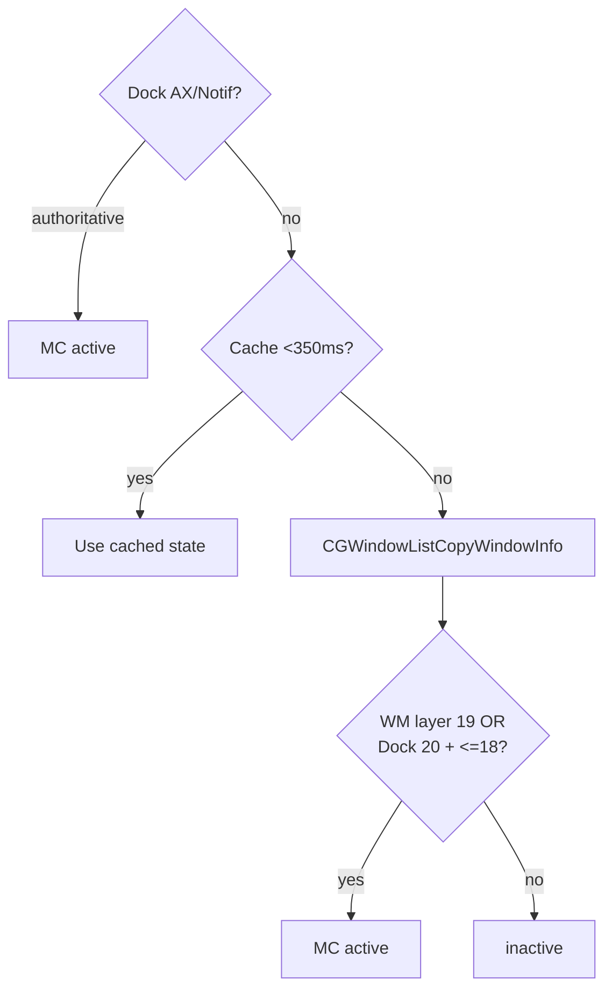

# Mission Control scoping

Every shortcut, gesture, and hover button in MCSC is **scoped to Mission
Control only**. This document explains how the app decides that Mission Control
is active, why the other full-screen layers are excluded, and how it recovers
when macOS gets stuck. The keyboard and gesture behaviors that depend on this
detection live in [SHORTCUTS.md](./SHORTCUTS.md) and
[GESTURES.md](./GESTURES.md).

---

## Why scoping matters

Mission Control, Launchpad, and expanded Finder folder stacks all draw
full-screen overlays. They look similar, but only Mission Control should receive
MCSC's window actions. Firing a close or minimize while Launchpad is open, or
while a Finder folder stack is expanded in the Dock, would act on the wrong
surface. Scoping keeps the app predictable.

---

## How detection works

`MissionControlService` uses a multi-layered approach:

- **Distributed Dock notifications.** It observes names such as
  `com.apple.MissionControl.start` and `com.apple.expose.start`. On current
  macOS versions these notifications often do not reach a standalone process, so
  this is only a fast path, not the source of truth.
- **Authoritative Dock AXObserver transitions.** `MissionControlHoverService`
  listens for Dock AX notifications (`AXExposeShowAllWindows`, `AXExposeExit`) and
  immediately synchronizes state with `MissionControlService.markActive(_:)`.
- **Window-list heuristic (Dock + WindowManager).** It calls `CGWindowListCopyWindowInfo`
  and inspects on-screen window layers:
  - **Modern macOS (macOS 27+ / WindowManager):** Mission Control composition is
    managed by `com.apple.WindowManager`, identified by its full-screen overlay at
    **layer 19** (along with the spaces bar at **layer 14**).
  - **Dock-managed Mission Control:** Mission Control exposes a full-screen Dock
    overlay at **layer 20** together with the Dock bar at **layer 18 or below**.
  - Transitions detected during scans automatically trigger `onActivated` and `onDeactivated` callbacks.

The result is cached for **350 ms** (`detectionCacheInterval`) so that gesture
frames never pay for a redundant WindowServer IPC scan on every trackpad event.

> [!NOTE]
> The heuristic intentionally excludes look-alikes. **Launchpad** draws its
> overlay at layers 27 to 29, which is above the Mission Control signature. An
> expanded **Finder folder stack** shows only the overlay window and lacks the
> Dock bar or WindowManager signature, so both are correctly ignored.

---

## Activation cooldown

When Mission Control activates, MCSC starts a 0.5-second cooldown. This prevents
the three-finger swipe that opened Mission Control from immediately triggering a
gesture. After the cooldown, gestures and shortcuts respond normally.

---

## Recovery sequence

Mission Control can swallow `Cmd + Space`, leaving macOS in a stuck state. While
Mission Control is open, MCSC repurposes `Cmd + Space` to run a recovery
sequence:

1. It posts `Escape` (key code 53) to dismiss the current overlay.
2. After 0.2 seconds it posts `Cmd + Space` (key code 49) to reopen the correct
   surface.

MCSC sets an `isSimulating` flag around the sequence so it does not react to its
own injected events.

---

## Keyboard Interaction & HID Event Tapping

Capturing keyboard events while Mission Control is open presents a unique macOS challenge:
- **Session-level event taps** (`.sessionEventTap`) fail to receive alphanumeric `keyDown` events because the WindowServer grabs keyboard input for Exposé.
- **Dedicated HID-level event tap:** MCSC installs `MCKeyboardTapService` at `.cghidEventTap` exclusively when Mission Control is active. This captures raw keystrokes before the WindowServer swallows them, enabling real-time fuzzy finding (`WindowSelectionEngine`).
- **Private Exposé SPIs:** MCSC leverages learnings from the open-source community (specifically [OpenMissionControl PR #3](https://github.com/nohackjustnoobb/OpenMissionControl/pull/3/changes)) for handling low-level Exposé states and `CoreDockSendNotification` wake mechanisms.

---

## Source references

- Detection heuristic and caching: `../MCSC/Services/MissionControl/MissionControlService.swift`
- Dedicated HID Key Tap: `../MCSC/Services/MissionControl/MCKeyboardTapService.swift`
- Fuzzy Selection Engine: `../MCSC/Models/WindowSelectionEngine.swift` & `WindowSearchSession.swift`
- Window Activation Actions: `../MCSC/Models/Actions/WindowActivationAction.swift` & `MissionControlWindowActions.swift`
- Search Overlay View: `../MCSC/Views/SearchBarOverlay.swift`
- Cooldown hook: `../MCSC/ViewModels/ShortcutViewModel.swift` (`onActivated`)
- Scoped delivery of gestures: `../MCSC/Services/Multitouch/MultitouchService.swift`
- Scoped delivery of shortcuts: `../MCSC/Services/EventTap/EventTapService.swift`
- Hover tracking & search session orchestration: `../MCSC/Services/MissionControl/MissionControlHoverService.swift`

#### Visual — Detection Flow

| Surface | Layers / Process | Result |
|---------|------------------|--------|
| Mission Control (macOS 27+) | `WindowManager` layer 19 | ✅ active |
| Mission Control (Classic) | `Dock` layer 20 + ≤18 | ✅ active |
| Launchpad | `Dock` layers 27-29 | ❌ inactive |
| Finder folder stack | only overlay (no Dock bar / WM overlay) | ❌ inactive |

