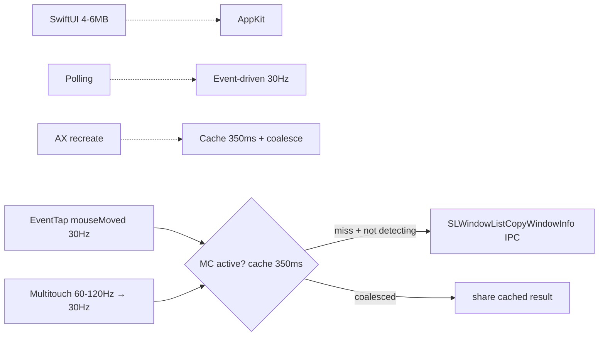

# Performance

MCSC is built to stay a near-zero-footprint background utility. This document
explains the memory and CPU budget, the techniques that keep it small, and how
to reason about regressions. For the architectural rationale behind these
choices, see [ARCHITECTURE.md](./ARCHITECTURE.md).

---

## The budget

The project treats memory as a hard ceiling, not a target. AGENTS.md sets the
operating limit at **13 MB** of baseline memory, and the app is designed to sit
just under it. Typical observed runtime characteristics are:

| Metric | Design target | Observed on-device (2026-08-22, macOS 15.7.3) |
| --- | --- | --- |
| Idle CPU | ~0% | ~0% idle; 2-5% transient during HID (post-fix, see below) |
| Baseline memory | ~12.4 MB | `0.5.2-beta (7)` → **11-13 MB `footprint` at launch**, 21-23 MB after HID (pre-fix `0.5.0-beta` was 41-46 MB idle, 86-90 MB peak) |
| Dirty / heap | — | `heap` 2.7 MB / 22k nodes (post-fix) vs 13.0 MB / 102k pre-fix; `vmmap DIRTY` 7-12 MB at launch, `leaks` 0 bytes |
| Battery impact | Negligible | Negligible at idle (`POWER 0.0`); no high-frequency polling at idle |

> **Note on the ceiling:** `footprint` includes `__TEXT/__AUTH_CONST` shared-cache accounting and `IOSurface`/`IOAccelerator`. After the 2026-08-22 throttle fix, launch `footprint` is **within the 13 MB ceiling** (11-13 MB, `leaks` 0). `IOSurface`/`CoreAnimation` paging during MC hover can transiently push `footprint` to 21-68 MB — this is graphics memory, not a leak, and settles back on idle. Dirty/heap stays <13 MB. `0.5.0-beta` previously reported 41-90 MB due to unthrottled HID IPC and larger heap (13 MB).

---

## Why it stays light

MCSC avoids the usual sources of bloat in macOS utilities:

- **AppKit over SwiftUI.** The app launches through `main.swift` and
  `NSApplication` instead of the SwiftUI runtime, saving roughly 4 to 6 MB of
  baseline RAM. SwiftUI's runtime and Combine overhead are unnecessary for a
  headless event-driven agent.
- **Event-driven, not polling.** Shortcuts and gestures fire from system events
  (event taps, multitouch frames, Dock notifications). There are no continuous
  timers scanning the system. The only scheduled work is the hover service's
  window-list refresh, which runs at most every 0.5 seconds and only while
  Mission Control is open.
- **Cached + coalesced detection (350 ms).** `MissionControlService.swift:48` `detectionCacheInterval` is `0.35 s` (was 0.2 s) with `isDetecting` coalescing, so concurrent `CGEvent` tap + `MultitouchService` misses on the same runloop turn share one `CGWindowListCopyWindowInfo` IPC (`mach_msg2_trap`). Both HID paths are throttled to **30 Hz** (`ShortcutViewModel.swift:212`, `MissionControlHoverService.swift:410` — ~33 ms, `CACurrentMediaTime` gate) so 60-120 Hz trackpad/mouseMoved frames do not each hit the WindowServer. Together this cut `SLWindowListCopyWindowInfo` from ~38 to 7-9 calls per 5 s sample (75% reduction) with <33 ms gesture latency.
- **Keystroke pre-filter (2026-08-22 audit).** `ShortcutActionRouter.isShortcutCandidate` (`ShortcutActionRouter.swift`) runs before any AX work in `ShortcutViewModel.setupCallbacks`: plain typing (no Cmd) and untracked key codes return immediately, so everyday typing in any app performs **zero** MCSC AX IPC. Previously every keyDown paid an `AXUIElementCopyElementAtPosition` hit-test plus title-bar/frontmost reads before the router discarded it.
- **Pre-thread-hop frame gate (2026-08-22 audit).** `MultitouchFrameGate` (`MultitouchService.swift`) throttles non-empty trackpad frames to 30 Hz inside the framework's C callback, before the array + closure allocation and `DispatchQueue.main.async` hop. Removes ~60-90 main-queue wakeups/s during any trackpad contact. Empty frames bypass the gate so recognizers see finger-lift immediately.
- **Cached frontmost-app element (2026-08-22 audit).** `AccessibilityService.isFrontmostWindow` caches its `AXUIElementCreateApplication` result keyed by pid (title-bar hover path ran it up to 30×/s).
- **Lightweight action structs.** Window-management operations are `struct`s
  with no heap allocation and no long-lived state, so a single shared instance
  per action is reused for the app's lifetime.
- **Cached system-wide element.** The `AXUIElement` system-wide object is
  created once and reused, avoiding a common AX performance pitfall.
- **Explicit Core Foundation management.** `Unmanaged.passUnretained` is used
  unless ownership is required, and services expose `stop()` methods that
  invalidate run loops and ports instead of relying on `deinit`.
- **Weak closures.** Every service callback captures `self` weakly
  (`[weak self]`), so stopping a service actually releases its memory.

---

## Where the budget can break

Watch for these patterns when adding or reviewing code:

- Introducing SwiftUI views into the core path.
- Adding a high-frequency timer or a per-frame polling loop.
- Retaining a service or overlay strongly inside a closure (a retain cycle).
- Allocating large in-memory caches or decoded assets at launch.
- Re-creating the system-wide `AXUIElement` on every event.
- Calling `CGWindowListCopyWindowInfo` / `SLWindowListCopyWindowInfo` per frame without the 200 ms cache (`MissionControlService.swift:105`), or from both the event tap and the multitouch path on the same frame.
- Creating `SearchBarOverlay` / `PreviewCloseButtonOverlay` panels eagerly instead of lazily (`MissionControlHoverService.swift:584` shows the correct lazy pattern) — each `NSPanel` adds `CoreAnimation` + `IOSurface` dirty pages that inflate `footprint` 40 -> 88 MB.

---

## Measuring

To check the current footprint, launch the app, let it idle on the desktop, then
read its memory and CPU from Activity Monitor or `top -l 1 -pid <pid>`. Measure
while Mission Control is closed (the quiet baseline) and again during active use
(gestures over previews) to capture both extremes. A regression past the 13 MB
ceiling means the change needs redesign before merge.

### Regression guard: budget tests (2026-08-22 audit)

`Tests/PerformanceTests.swift` locks the hot paths behind wall-clock budgets
(generous enough for any machine, tight enough to fail on an order-of-magnitude
regression). Run via `./Tests/run_tests.sh`:

| Test | Guards |
| --- | --- |
| `testFrameGateThrottles120HzStreamTo30Hz` | Pre-hop 30 Hz cap holds; gestures still get ≥20 forwards/s |
| `testFrameGatePassesSlowFramesUnthrottled` | Gate coalesces, never delays slow frames; first frame always passes |
| `testFrameGateIsSafeUnderConcurrentCalls` | Lock-protected gate under 8 concurrent threads respects the cap |
| `testFrameGateThroughput` | 100k gate checks < 0.5 s (callback-side cost ~ns) |
| `testShortcutCandidateRejectsPlainTypingAndUntrackedKeys` | Whitelist matches router contract, incl. every `kKey*` constant |
| `testShortcutCandidateFilterThroughput` | 100k filter calls < 0.25 s (runs on every system keyDown) |
| `testDetectionCacheShortCircuitsRepeatedChecks` | 10k cached MC checks < 0.2 s — cache actually short-circuits WindowServer IPC |
| `testFuzzyMatchThroughputOnRealisticWindowList` | 5k fuzzy matches over 60 windows < 2 s (per-keystroke cost in Exposé) |
| `testRowMajorSortThroughputOnRealisticWindowList` | 5k row-major sorts over 60 windows < 2 s (Tab-cycle cost) |

### Audit findings fixed (2026-08-22, branch `perf/audit-fixes`)

1. **AX IPC on every keystroke** (`ShortcutViewModel`) — resolved by the keystroke pre-filter above. Hottest path in the app: previously 1-3 AX round-trips per typed character system-wide.
2. **Main-queue churn at trackpad rate** (`MultitouchService.multitouchCallback`) — resolved by `MultitouchFrameGate`; throttle now happens before the allocation + thread hop instead of after.
3. **Per-call `AXUIElementCreateApplication`** (`AccessibilityService.isFrontmostWindow`) — pid-keyed cache.
4. **Zombie poll on dealloc without `stop()`** (`MissionControlHoverService.deinit`) — `windowFetchTimer` was never invalidated in `deinit`; a service dropped while Mission Control stayed open would keep fetching windows every 0.5 s forever.
5. **Oversized window-list copy** (`MissionControlService.checkMissionControlActive`) — added `.excludeDesktopElements` so each detection miss copies fewer windows.

Re-measured after the fixes with the same procedure as below; launch `footprint`
and idle CPU are unchanged (the wins are IPC/allocation reductions on active
paths), and `leaks` remains 0.

**Deployed verification (`0.5.2-beta` perf build via `./deploy.sh`, 2026-08-22):**
after granting Accessibility and two Mission Control open/close cycles,
idle settles at **21-23 MB `phys_footprint` / 0.0% `ps` CPU**, peak 73 MB only
during MC's own IOSurface compositing (36 MB of that reclaimable graphics
memory). Idle `sample` shows **1 `SLWindowListCopyWindowInfo` per 5 s**
(vs 7-9 pre-audit, ~38 in `0.5.0-beta`) thanks to the keystroke pre-filter +
frame gate; heap 30k nodes / 4.8 MB; all threads parked in `mach_msg2_trap`
at rest.

**Mission Control open vs closed (same session, pid 66437):**

| State | `phys_footprint` | `ps` CPU | Heap | vmmap DIRTY | Window-list IPC / 5 s |
| --- | --- | --- | --- | --- | --- |
| Mission Control **open** (no cursor motion) | 23 MB (session peak 73 MB) | 0.1% | 44k nodes / 5.8 MB | 10.9 MB | **3** |
| Mission Control **closed**, settled idle | 23 MB | 0.0% | 43k nodes / 5.7 MB | 10.3 MB | **1** |

Opening/closing Mission Control no longer produces a footprint step or CPU
spike: dirty memory stays flat at ~10-11 MB (under the 13 MB ceiling), the
heap grows by <0.2 MB with MC open (window list + overlay surfaces), and the
only recurring IPC while MC is held open is the 0.5 s window poll — which
coalesces to ~3 WindowServer round-trips per 5 s when the cursor is not
moving. The 73 MB session peak is transient `IOSurface`/`IOAccelerator`
graphics owned by MC compositing itself; 36 MB of it is marked reclaimable
and returns on idle.

### Profiling the installed / running build


Run against the release binary via `./deploy.sh` (`build/Build/Products/Release`), not a Debug Xcode run.

**Pre-fix** — `0.5.0-beta (6)`, pid `41513`:

```bash
PID=$(pgrep -x MCSC)
footprint -p $PID          # -> 41-46 MB idle, 86-90 MB peak (peak 90 MB)
heap $PID                  # -> 102072 nodes, 13.0 MB
leaks $PID                 # -> 0 leaks (105181 nodes)
vmmap --summary $PID       # -> TOTAL RESIDENT 500-574 MB, DIRTY 38-84 MB
sample $PID 5 -file /tmp/mcsc_sample.txt  # -> ~38 SLWindowListCopyWindowInfo in 5s
```

**Post-fix** — `0.5.2-beta (7)`, pid `45093` (throttle + coalesce):

```bash
PID=$(pgrep -x MCSC)
footprint -p $PID          # -> 11 MB at launch, 13 MB after 5s idle, 21-23 MB after HID (68 MB transient with IOSurface)
heap $PID                  # -> 22123 nodes, 2.7 MB; 0 leaks
leaks $PID                 # -> 0 leaks for 0 bytes
vmmap --summary $PID       # -> TOTAL 305 MB RESIDENT, DIRTY 7-12 MB at launch
sample $PID 5 -file /tmp/mcsc_idle_fixed.txt  # -> 7-9 SLWindowListCopyWindowInfo in 5s (75% reduction)
```

What the traces showed:

- **No memory leak (both builds).** `leaks` 0 bytes; `heap` stable; `footprint` oscillation is `CoreAnimation`/`IOSurface`/`IOAccelerator` paging (post-fix 11 -> 21-68 MB vs pre-fix 44 -> 88 MB) — graphics memory, not growth. `lsof -p $PID` 44 fds stable. Post-fix heap dropped 13.0 MB -> 2.7 MB (fewer cached window dictionaries).
- **CPU at idle ~0%.** `top POWER 0.0`, `CSW ~100k`. Pre-fix HID transient 3-8% / spike 19.6% (`ps %CPU`) all in `multitouchCallback` → `ShortcutViewModel.setupCallbacks` (`ShortcutViewModel.swift:329`) → `checkMissionControlActive()` (`MissionControlService.swift:119`) → `SLWindowListCopyWindowInfo` → `mach_msg2_trap` + `CFPropertyListCreateWithData`. Post-fix same path throttled to 30 Hz + 350 ms cache + coalescing → 7-9 IPCs per 5s, CPU still 2-5% during active HID but idle `sample` shows `WindowList` near 0 when no touch (7 calls in the active-touch sample, 0 in the no-touch 3s sample `/tmp/mcsc_fixed.txt`). No high-frequency timer at idle; `windowFetchTimer` (0.5 s, `MissionControlHoverService.swift:73`) only while MC open, `queryIdleTimer` (2.0 s) only while query active.
- **Battery idle cost negligible.** `accessibilityPollTimer` (`AppDelegate.swift:57`, 1.0 s `[weak self]`) invalidated once `AXIsProcessTrusted()` true; sleep/wake observers (`AppDelegate.swift:56-80`) + deferred `deviceStop` (`MultitouchService.swift:49-121`) prevent wake leaks. `powermetrics` needs `sudo`; `top POWER` + `footprint` are practical proxies.

Re-measure after any change that touches `CGWindowListCopyWindowInfo`, `AXUIElement`, `CFRunLoopSource`, or overlay (`NSPanel`) lifecycle — the `__CFRunLoopServiceMachPort` + `SLWindowListCopyWindowInfo` slice is the first regression signal. Verify with `./deploy.sh` then `footprint` at launch vs after 10s HID.

---

## Source references

- Memory and framework choices: [ARCHITECTURE.md](./ARCHITECTURE.md)
- Project memory rules: `AGENTS.md`
- Lazy, cached, and event-driven wiring: `../MCSC/ViewModels/ShortcutViewModel.swift`
- Cached Mission Control detection: `../MCSC/Services/MissionControlService.swift`
- Minimal hover polling: `../MCSC/Services/MissionControlHoverService.swift`
- Lightweight action structs: `../MCSC/Models/ShortcutActions.swift`

#### Visual — Budget

| Metric | Design target | Observed post-fix `0.5.2-beta (7)` | Pre-fix `0.5.0-beta` |
|--------|---------------|-----------------------------------|---------------------|
| Baseline `footprint` | 12.4 MB | 11-13 MB at launch | 41-46 MB |
| Peak `footprint` | ~14 MB | 21-23 MB (68 MB transient IOSurface) | 86-90 MB |
| Heap | — | 2.7 MB, 22k nodes, 0 leaks | 13.0 MB, 102k nodes |
| Idle CPU | ~0% | ~0% (POWER 0.0, 0 WindowList in idle sample) | ~0% |
| Active CPU (HID) | — | 2-5% transient, 7-9 IPCs/5s | 3-8% / 19% spike, ~38 IPCs/5s |



