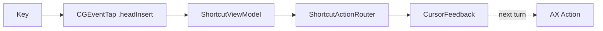
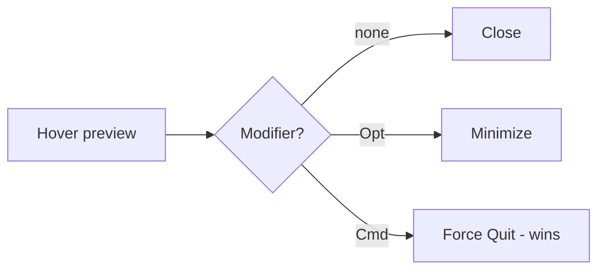

# Keyboard shortcuts & hover buttons

This document lists every keyboard-driven action MCSC provides and the
interactive hover buttons that appear inside Mission Control. For trackpad
gestures, see [GESTURES.md](./GESTURES.md). For the symbol language used in
feedback overlays, see [SYMBOLS.md](./SYMBOLS.md).

All shortcuts and hover buttons below are **scoped to Mission Control only**.
They fire while Mission Control is open and stay silent on the normal desktop,
in Launchpad, and in expanded Finder folder stacks. Read
[ARCHITECTURE.md](./ARCHITECTURE.md) for the detection heuristic.

---

## How the shortcuts work

MCSC intercepts key presses with a low-level `CGEventTap` placed at
`.headInsertEventTap`, so it sees each event before the frontmost app does. The
`EventTapService` forwards raw key codes and modifier flags to
`ShortcutViewModel`, which decides whether the combination matches a known
shortcut.

A shortcut matches only when **Command is held and no other modifier is
pressed**. Holding Shift, Control, or Option alongside Command disables the
keyboard shortcut path (those modifiers are reserved for gestures and the hover
button). Every shortcut also requires Mission Control to be active; otherwise
the event passes through untouched.

When a shortcut fires, MCSC shows cursor feedback first, then runs the blocking
Accessibility action one run-loop turn later. This ordering lets the symbol
render at the moment you press the key, instead of after the window has already
closed.

---

## Type-to-Select (Mission Control Window Fuzzy Finder)

While Mission Control is active, you can **simply start typing** any application or window name (e.g. `code`, `ghostty`, `xcode`, `finder`) to instantly filter and select windows via keyboard:

- **Fuzzy matching:** `WindowSelectionEngine` ranks matching window owner names (exact prefix matches ranked highest, followed by substring matches, sorted alphabetically and by window number).
- **Native highlight synchronization:** Matches post a synthetic `.mouseMoved` event to the top-left thumbnail shoulder point. This triggers macOS Mission Control's native blue highlight and scaling animation and syncs `hoveredWindow` in `MissionControlHoverService`, so existing `Cmd` shortcuts (`Cmd+W`, `Cmd+Q`, `Cmd+M`) seamlessly work against the fuzzy selection.
- **Top-left shoulder targeting:** Targeting the top-left shoulder of the window bounds (inset 20 pt right and down) rather than the thumbnail center ensures windows stacked under "group windows by application" remain targetable even when their centers are hidden behind the front window, while staying safely clear of the close/minimize button bar.
- **Dock-styled search pill:** An uppercase, bold floating search pill (`SearchBarOverlay`) styled with continuous squircle corners (`layer.cornerCurve = .continuous`) and macOS HUD material floats right above the Dock, dynamically scaling to the query length.
- **Activation with dwell click:** Pressing `Enter` or `Return` triggers `WindowActivationAction.performSyntheticClick`, which injects a `mouseMoved` → `leftMouseDown` → **50 ms dwell** → `leftMouseUp` sequence at `.cghidEventTap`. The 50 ms dwell guarantees WindowServer registers the click and activates the window.
- **Idle auto-clear:** If no key is typed for 2 seconds (or if `Escape` is pressed), the query session resets to `-1` (mouse-only mode).

| Key | Function |
| --- | --- |
| `A-Z`, `0-9` | Appends characters to search query and highlights best matching window |
| `Enter` / `Return` | Activates and focuses the selected window (dismissing Mission Control) |
| `Tab` ( / `Down Arrow` when searching) | Cycles forward — when query typed (e.g. `code`) cycles only filtered matches; when query empty cycles all visible thumbnails row-major (wrap-around) |
| `Shift+Tab` ( / `Up Arrow` when searching) | Cycles backward — same scope as Tab |
| `Backspace` (`Delete`) | Removes the last typed character (resets to mouse mode if query becomes empty) |
| `Escape` | Clears search query and hides the search pill (press again to dismiss Mission Control) |

> **Toggle:** All Tab / Return keyboard navigation is gated by **MCSC → Keyboard Navigation (Tab / Return)** (default on) and by **MCSC → Settings… → Enable Keyboard Navigation**. When disabled, keystrokes pass through to the system. With the toggle on, the search pill / session stays until you activate (Return) or clear (Escape) — no 2 s idle timeout.

---

## Global keyboard shortcuts

These shortcuts work anywhere a window or app is targeted inside Mission Control.
Point at a window preview to act on that window, or point at a Dock item (app
icon) to act on the whole app.

| Shortcut | Window target | Dock (app) target | Default |
| --- | --- | --- | --- |
| `Cmd + W` | Close the window | Close the active tab in the app | ON |
| `Cmd + Q` | Force quit the app owning the window | Force quit the app | ON |
| `Cmd + M` | Minimize the window | Minimize all windows of the app | ON |
| `Cmd + H` | Hide the app owning the window | Hide the app | ON |
| `Cmd + F` | Toggle fullscreen (`kAXZoomButtonAttribute`) | Toggle fullscreen (all windows) | OFF |
| `Cmd + T` | New tab (`Cmd+T`) | New window (`Cmd+N` fallback) | OFF |
| `Cmd + N` | New window (`Cmd+N`) | New window (`Cmd+N`) | OFF |
| `Cmd + Shift + T` | Reopen last closed tab (`Cmd+Shift+T`) | Reopen tab (to app) | OFF |
| `Cmd + Space` | Recover the Mission Control / Spotlight state (see below) | Same | ON |

> Config: `ShortcutConfiguration` (`mcsc.shortcuts.*`) — toggled in **Settings → Shortcuts** (`MCSC/Views/Settings/Panes/MCSCSettingsPanes.swift:142`). Window shortcuts require `Cmd` held without `Ctrl/Opt/Shift` (except the `Cmd+Shift` combos). All require `isMissionControlActive || isDockActionsOutsideMCEnabled`.

---

## All 16 Actions — Categorized (Shortcut vs Gesture)

Source of truth: `GestureAction` (`MCSC/Models/Gestures/GestureAction.swift:87`, `CaseIterable` 16) — every action is executable via **gesture** (re-mappable), only a subset has a **dedicated keyboard shortcut**. Routers: `ShortcutActionRouter.swift:32` (keyboard) vs `GestureActionRouter.swift:24` (trackpad).

### Tab — `MCSC/Models/Actions/TabActions.swift`

| Action | Keyboard | Gesture default | Window (`at:point`) | Dock (`app:`) |
| --- | --- | --- | --- | --- |
| `Close Tab` | `Cmd+W` (fallback when no tab strip) | `Swipe Left` plain | `WindowCloser(.activeTab)` — `findActiveTabCloseButton` else focus + `Cmd+W` (`0x0D`) | `WindowCloser(.activeTab)` — keyWindow tab btn else `Cmd+W` |
| `Reopen Tab` | `Cmd+Shift+T` | `Swipe Right` plain | `ReopenTabAction` `Cmd+Shift+T` (`0x11`) | `ReopenTabAppAction` `Cmd+Shift+T` to `pid` |
| `New Tab` | `Cmd+T` (window only) | `Cmd+Swipe Right` | `NewTabAction` `Cmd+T` (`0x11`) | fallback → `NewWindowAction` `Cmd+N` (`GestureActionRouter.swift:108`) |

### Close family — `MCSC/Models/Actions/WindowCloser.swift`

All close variants flow through one `WindowCloser.perform(scope:at:fromApp:service:)`;
a non-nil `app` means a Dock trigger (key window / full window list), otherwise
the hovered window under `point` is resolved.

### Window — `MCSC/Models/Actions/WindowActions/WindowControlActions.swift`

| Action | Keyboard | Gesture default | Impl |
| --- | --- | --- | --- |
| `Close Window` | — (gesture-only) | `Pinch In` plain | `WindowCloser(.window/.wholeApp)` `kAXCloseButtonAttribute` + `kAXPressAction`; zero windows from Dock = no-op (no terminate) |
| `Minimize` | `Cmd+M` | `Swipe Up` plain | `MinimizeWindowAction` `kAXMinimizeButtonAttribute` / `MinimizeAppAction` (dock: loops `kAXWindowsAttribute`) |
| `Toggle Fullscreen` | `Cmd+F` (OFF) | `Pinch Out` plain | `ToggleFullscreenAction` `kAXZoomButtonAttribute` + `CoreDockSendNotification("com.apple.expose.awake")` |

### Size — `MCSC/Models/Actions/WindowActions/SizeActions.swift:3` (`setFrame`, no shortcut posting)

| Action | Keyboard | Gesture default | Impl |
| --- | --- | --- | --- |
| `Fill Screen` | — | `Swipe Down` plain | `FillScreenAction` `setFrame(axBounds)` full screen |
| `Almost Maximize` | — | `Cmd+2-Finger Double Tap` | `AlmostMaximizeAction` `90.4×87.2%` centered |
| `Reasonable Size` | — | `2-Finger Double Tap` plain | `ReasonableSizeAction` `60.4×58%` centered |
| `Make Larger` | — | `Cmd+Swipe Down` | `MakeLargerAction` `×1.33` center-anchored, clamped |
| `Make Smaller` | — | — (unbound) | `MakeSmallerAction` `÷1.33` (200×100 pt floor) — inverse of Make Larger |

### App — `MCSC/Models/Actions/AppActions.swift:3`

| Action | Keyboard | Gesture default | Impl |
| --- | --- | --- | --- |
| `Quit App` | `Cmd+Q` | `Cmd+Pinch In` | `ForceQuitAction` / `ForceQuitAppAction` `forceTerminate()` (self-kill guard) |
| `Hide App` | `Cmd+H` | `Cmd+Swipe Up` | `HideApplicationAction` / `app.hide()` |
| `New Window` | `Cmd+N` | `Cmd+Pinch Out` | `NewWindowAction` `Cmd+N` (`0x2D`) + `CoreDockSendNotification` |

### Desktop (Space) — `MCSC/Models/Actions/WindowActions/DesktopNavigationActions.swift:16` (window drag)

| Action | Keyboard | Gesture default | Impl |
| --- | --- | --- | --- |
| `Move to Next Desktop` | — | `Cmd+Swipe Right` alt (`naturalActions`) | `MoveWindowToDesktopAction(.next)` hold title bar (`40,12`) → `System Events` `Ctrl+→` (`124`) via `osascript` (~1.7s) |
| `Move to Previous Desktop` | — | `Swipe Left` alt | `MoveWindowToDesktopAction(.previous)` `Ctrl+←` (`123`) |

> **Summary:** 5 keyboard shortcuts ON by default (`W/Q/M/H/Space`), 5 extra OFF (`F/T/N/ShiftW/ShiftT`), 7 size/desktop actions are **gesture-only or unbound**. All 17 are re-mappable in **Settings → Gestures** (`GestureSettingsPane:338`, `naturalActions` filter `GestureAction.swift:63`); use `GestureAction.allCases` to allow any action on any gesture.

> [!NOTE]
> `Cmd + Q` and the Dock-target actions perform a **force** termination. They
> skip the normal quit handshake, so unsaved work in the targeted app is lost.

### Shortcuts outside Mission Control

All dock-targeted keyboard shortcuts (`Cmd + W`, `Cmd + Q`, `Cmd + M`, `Cmd + H`)
can also work while hovering a Dock icon in **normal desktop mode** (Mission
Control closed) — no need to open Mission Control first. While 2+ fingers rest on
the trackpad over the Dock, MCSC also suppresses App Exposé (two-finger double-tap
smart zoom) and synthesized clicks so gestures aim cleanly at Dock icons.

- **Toggle:** Settings → General **Dock Gestures & Shortcuts**
  (`ShortcutConfiguration.isDockActionsOutsideMCEnabled`, default `false`,
  persisted to `UserDefaults` under `mcsc.dockActionsOutsideMC.enabled`).
- **Implementation:** `ShortcutActionRouter` admits `.dock` targets when
  `isMissionControlActive || isDockActionsOutsideMCEnabled`;
  `DockInteractionSuppressor` (Quartz event tap at HID level) swallows
  `smartMagnify` / `magnify` / gesture events and synthesized clicks over the
  Dock; `AccessibilityService.isDockRegion(at:)` provides cached-frame hit
  testing with a direct Dock-process AX fallback for `-25200` errors.

### Title bar shortcuts outside Mission Control

The same keyboard shortcuts can also work while hovering the **title bar of the
frontmost window** in normal desktop mode. Background windows' title bars never
trigger actions — only the frontmost app's focused window qualifies.

- **Toggle:** Settings → General **Title Bar Gestures & Shortcuts**
  (`ShortcutConfiguration.isTitleBarActionsOutsideMCEnabled`, default `false`,
  persisted to `UserDefaults` under `mcsc.titleBarActionsOutsideMC.enabled`).
- **Implementation:** `ShortcutViewModel.isTitleBarHover(window:at:)` checks the
  cursor is inside the top ~28 pt strip of the resolved window frame and that
  the window is the frontmost application's focused window
  (`AccessibilityService.isFrontmostWindow(_:)`); `ShortcutActionRouter` then
  admits `.window` targets when `isTitleBarActionsOutsideMCEnabled`.

### Mounted volume auto-eject (`Cmd + W` / `Cmd + Q` on ejectable Finder volumes)

When the cursor targets a **Finder window that shows an ejectable/removable volume**
(e.g. a mounted DMG installer under `/Volumes`) in Mission Control, `Cmd + W` and
`Cmd + Q` automatically **close the Finder window and eject the volume** instead of
their normal close/quit action. This is intended for quickly dismissing installer
disks.

- **Detection:** via `MountedVolumeService.ejectableVolumePath(forDocumentPath:windowTitle:)` —
  reads `kAXDocumentAttribute` (file URL or `/Volumes/...` path) and `kAXTitleAttribute`
  from the window (`AccessibilityService.getDocumentPath` / `getWindowTitle`), then
  matches against `FileManager.mountedVolumeURLs` filtered by `volumeIsEjectable` /
  `volumeIsRemovable`. Finder-only (`bundleIdentifier == "com.apple.finder"`).
- **Action:** `EjectVolumeAction` presses the window's `kAXCloseButton` (best-effort)
  then calls `MountedVolumeService.ejectVolume(at:)` which runs `NSWorkspace.shared.unmountAndEjectDevice(at:)` off the main queue.
- **Feedback:** flashes `eject.circle.fill` at the cursor — White + systemRed palette
  (`[.white, .systemRed]`) with the same hover-style scale (1.08× over 0.15 s ease-out)
  and alpha animation used for close/quit (`CursorFeedbackOverlay.swift:197`).
- **Toggle:** menu bar **Auto-Eject Mounted Volumes** (`ShortcutConfiguration.isAutoEjectEnabled`, default `true`)
  — when disabled, `Cmd+W`/`Cmd+Q` fall through to their normal `.close`/`.quit` paths.
  The same eject check also applies to pinch-in / swipe-left gestures (see [GESTURES.md](./GESTURES.md)).
- **Scopes:** window targets only; Dock-target `Cmd+W`/`Cmd+Q` and non-Finder windows are unaffected.

### Mission Control recovery (`Cmd + Space`)

While Mission Control is open, pressing `Cmd + Space` does not open Spotlight.
Instead MCSC replays a recovery sequence so macOS leaves the stuck Mission
Control state:

1. It posts `Escape` (key code 53) to dismiss the current overlay.
2. After 0.2 seconds it posts `Cmd + Space` (key code 49) to reopen the correct
   surface.

MCSC ignores its own injected `Cmd + Space` events to avoid a feedback loop
(`MissionControlService.isSimulating` guards this).

---

## Mission Control hover action buttons

While Mission Control is open, MCSC renders a floating, clickable button at the
top-left vertex of every window preview. The button's action changes based on
the modifier you hold, and the SF Symbol animates to match. This is the same
overlay family described in [SYMBOLS.md](./SYMBOLS.md) under the hover-button
system (`PreviewCloseButtonOverlay`).

| Held modifier | Button action | SF Symbol | What happens on click |
| --- | --- | --- | --- |
| *(none)* | Close | `xmark.circle.fill` | Presses the window's native close button via Accessibility |
| `Option` | Minimize | `minus.circle.fill` | Presses the window's native minimize button |
| `Command` | Force quit | `xmark.circle.fill` | Force terminates the owning app |

> [!IMPORTANT]
> When both `Command` and `Option` are held, **Command wins** and the button
> becomes a force-quit. This precedence is enforced in
> `MissionControlHoverService.currentOverlayMode`.

The button appears only while the cursor is over a window preview and hides when
you move off it. Clicking the button swallows the mouse event so Mission Control
does not dismiss prematurely, plays a haptic, and runs the selected action.

---

## Source references

- Key handling and shortcut-to-action mapping:
  `../MCSC/ViewModels/ShortcutViewModel.swift` + `../MCSC/ViewModels/Routing/ShortcutActionRouter.swift` (eject branch + `volumeService`) + `../MCSC/ViewModels/Routing/GestureActionRouter.swift` + `../MCSC/Models/Gestures/GestureAction.swift` (17 `GestureAction`, `GestureKind.naturalActions`)
- Action implementations (categorized):
  `../MCSC/Models/Actions/TabActions.swift` (Tab 4) · `../MCSC/Models/Actions/WindowActions/WindowControlActions.swift` (Window 3) · `../MCSC/Models/Actions/WindowActions/SizeActions.swift` (Size 5) · `../MCSC/Models/Actions/AppActions.swift` (App 3) · `../MCSC/Models/Actions/WindowActions/DesktopNavigationActions.swift` (Space 2) + `../MCSC/Models/Actions/VolumeActions.swift` (`EjectVolumeAction`)
- Mounted volume detection/ejection: `../MCSC/Services/Volume/MountedVolumeService.swift` (`MountedVolumeService`, `NSWorkspace.unmountAndEjectDevice`)
- Accessibility document/title helpers: `../MCSC/Services/Accessibility/AccessibilityService.swift` (`getDocumentPath`, `getWindowTitle`)
- Menu bar toggle: `../MCSC/App/AppDelegate.swift` (`Auto-Eject Mounted Volumes` → `ShortcutConfiguration.isAutoEjectEnabled`)
- Hover overlay, modifier precedence, and click handling:
  `../MCSC/Services/MissionControlHoverService.swift`
- Low-level key interception: `../MCSC/Services/EventTapService.swift`
- Mission Control detection and `Cmd + Space` recovery:
  `../MCSC/Services/MissionControlService.swift`
- Feedback symbols shown at the cursor: `../MCSC/Views/CursorFeedbackOverlay.swift`
- Hover button rendering: `../MCSC/Views/PreviewCloseButtonOverlay.swift`

#### Visual — Shortcut & Hover

