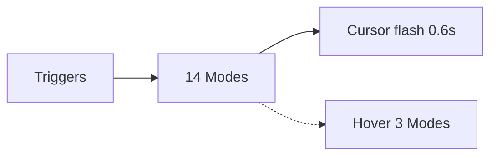

# SF Symbols & Action Mapping

Reference for the visual language of MCSC: every SF Symbol the app renders, the
action it represents, and exactly where it is triggered. Use this document when
extending the feedback system or auditing the UI.

---

## Overview: the two overlay systems

MCSC renders symbols in two distinct places, both data-driven:

| System | File | Anchoring | Interactive | Lifecycle |
|---|---|---|---|---|
| `CursorFeedbackOverlay` | `../MCSC/Views/CursorFeedbackOverlay.swift` | Mouse cursor | No — ignores all mouse events | Transient flash (~0.6 s), auto-retracts |
| `PreviewCloseButtonOverlay` | `../MCSC/Views/PreviewCloseButtonOverlay.swift` | Top-left vertex of a Mission Control window preview | Yes — clickable hover button | Persistent while hovering the window |

- **Cursor feedback** plays *before* the underlying (blocking AX) action runs so
  the flash commits on the run loop before the action starves it.
- **Hover button** changes its action/symbol dynamically as the user holds
  modifier keys (see [§ 2](#2-hover-button-symbols)).

---

## 1. Cursor feedback symbols — `CursorFeedbackOverlay.Mode`

There are **14** modes. Each mode is a small data descriptor: SF Symbol name,
accessibility label, tint palette, optional entry animation, and optional
replacement transition.

| Mode | SF Symbol | Base symbol | Accessibility label | Palette | Entry animation | Replace transition |
|---|---|---|---|---|---|---|
| `.close` | `xmark.circle.fill` | — | Close Window | System multicolor (red X) | `.bounceUpByLayer` + hover-style scale-up + fade-in\* | — |
| `.minimize` | `minus.circle.fill` | `minus.circle` (white\*\*) | Minimize Window | Black + system yellow | hover-style scale-up + fade-in\* | `.downUpReveal` |
| `.quit` | `xmark.circle.fill` | — | Force Quit | Black → purple gradient | `.bounceUpByLayer` + hover-style scale-up + fade-in\* | — |
| `.hide` | `eye.slash.circle.fill` | `eye.slash.circle` (white\*\*) | Hide Application | Black + system yellow | — | `.downUpReveal` |
| `.eject` | `eject.circle.fill` | `eject.fill` | Eject Volume | White + systemRed (`[.white, .systemRed]`) | hover-style scale-up + fade-in\* | `.magicDownUpReveal`\*\*\* |
| `.almost` | `inset.filled.rectangle` | `rectangle` | Almost Maximize Window | Accent (`controlAccentColor`) | — | `.downUpReveal` |
| `.reasonable` | `inset.filled.center.rectangle` | `rectangle` | Reasonable Size | Accent (`controlAccentColor`) | — | `.downUpReveal` |
| `.maximize` | `rectangle.fill` | `rectangle` | Maximize Window | Accent (`controlAccentColor`) | — | `.downUpReveal` |
| `.makeSmaller` | `arrow.up.right.and.arrow.down.left.rectangle` | — | Make Smaller Window | Accent (`controlAccentColor`) | — | — |
| `.closeTab` | `xmark.rectangle.fill` | — | Close Tab | System multicolor (red X) | `.wiggleByLayer` | — |
| `.reopenTab` | `plus.rectangle.fill` | — | Reopen Tab | Black + system green (`[.black, .systemGreen]` at 100%) | `.wiggleByLayer` | — |
| `.newWindow` | `rectangle.badge.plus` | — | New Window | System green | `.wiggleByLayer` | — |
| `.newTab` | `plus.rectangle.on.rectangle` | — | New Tab | System green | `.wiggleByLayer` | — |
| `.fullscreen` | `arrow.down.left.and.arrow.up.right.circle.fill` | — | Toggle Fullscreen | Black + system green (`[.black, .systemGreen]`) — same as `PreviewCloseButtonOverlay.Mode.fullscreen` | hover-style scale-up + fade-in\* | — |

\* "hover-style scale-up + fade-in" is not a symbol effect; it is an
  `NSAnimationContext` scale (1.03× — kept small so the glyph never clips at
  the flash panel's bounds) + alpha (0.97 → 1.0) over 0.15 s
  ease-out, applied on entry — used by
  `.close`, `.quit`, `.eject`, and `.fullscreen` (`CursorFeedbackOverlay.swift:206`).
\* The base symbol is painted synchronously before the replace transition
  fires, so the morph always starts from a stable silhouette.
\*\* Minimize and Hide paint their base glyph in plain white
  (`basePaletteColors = [.white]`) so the pre-morph state reads as neutral
  before filling into the black/yellow palette.
\*\*\* `.magicDownUpReveal` uses `.replace.magic(fallback: .downUp.wholeSymbol)`
  on macOS 26+ and falls back to `.replace.downUp.wholeSymbol` on macOS 14/15.
  `.downUpReveal` is `.replace.downUp.byLayer` (macOS 14+, no fallback).
  `.wiggleByLayer` (`.wiggle.byLayer`) and `.bounceUpByLayer`
  (`.bounce.up.byLayer`) are available on macOS 14/15+ with no version gate.

**Source:** the `Mode` enum in `CursorFeedbackOverlay.swift`. `CaseIterable`
lets the unit tests walk the whole set (see [§ 8](#8-verification)).

---

## 2. Hover button symbols — `PreviewCloseButtonOverlay.Mode`

The Mission Control hover button has **3** modes, selected by held modifier:

| Held modifier | Mode | SF Symbol | Accessibility label | Palette | Action on click |
|---|---|---|---|---|---|
| *(none)* | `.close` | `xmark.circle.fill` | Close Window | System multicolor (red X) | Close window (AX close button) |
| `Option` | `.minimize` | `minus.circle.fill` | Minimize Window | Black + system yellow | Minimize window (AX minimize button) |
| `Command` | `.quit` | `xmark.circle.fill` | Force Quit | Black → purple gradient | Force terminate app |

> **Precedence:** when both `Cmd` and `Option` are held, **Cmd wins** →
> `.quit`. This is enforced by `MissionControlHoverService.currentOverlayMode`.

**Source:** `PreviewCloseButtonOverlay.Mode` + `MissionControlHoverService`
(`currentOverlayMode`, `executeAction`).

---

## 3. Trigger → Symbol → Action mapping

All shortcuts and gestures below are scoped to **Mission Control only**.
Feedback mode = the symbol shown at the cursor when the trigger fires.

| Trigger | Feedback mode | SF Symbol | Action performed |
|---|---|---|---|
| `Cmd + W` | `.close` | `xmark.circle.fill` | Close tab (window) / close tab in app (Dock) |
| `Cmd + W` on ejectable Finder volume window\* | `.eject` | `eject.circle.fill` | Close Finder window + eject volume |
| `Cmd + Q` | `.quit` | `xmark.circle.fill` | Force quit app |
| `Cmd + Q` on ejectable Finder volume window\* | `.eject` | `eject.circle.fill` | Close Finder window + eject volume |
| `Cmd + M` | `.minimize` | `minus.circle.fill` | Minimize window |
| `Cmd + H` | `.hide` | `eye.slash.circle.fill` | Hide app |
| Pinch-in | `.close` | `xmark.circle.fill` | Close window / quit app |
| Pinch-in on ejectable Finder volume window\* | `.eject` | `eject.circle.fill` | Close Finder window + eject volume |
| `Cmd + Pinch-in` | `.quit` | `xmark.circle.fill` | Force quit app |
| `Cmd + Pinch-in` on ejectable Finder volume window\* | `.eject` | `eject.circle.fill` | Close Finder window + eject volume |
| Two-finger swipe left | `.closeTab` | `xmark.rectangle.fill` | Close tab |
| Swipe left on ejectable Finder volume window\* | `.eject` | `eject.circle.fill` | Close Finder window + eject volume |
| `Cmd + swipe left` | `.close` | `xmark.circle.fill` | Close window |
| Two-finger swipe right | `.reopenTab` | `plus.rectangle.fill` | Reopen closed tab |
| `Cmd + swipe right` (window) | `.newTab` | `plus.rectangle.on.rectangle` | New tab (`Cmd+T`) |
| `Cmd + swipe right` (Dock) | `.newWindow` | `rectangle.badge.plus` | New window |
| Two-finger swipe up | `.minimize` | `minus.circle.fill` | Minimize window |
| `Cmd + swipe up` | `.hide` | `eye.slash.circle.fill` | Hide app |
| Two-finger swipe down | `.maximize` | `rectangle.fill` | Fill screen |
| `Cmd + swipe down` | `.maximize` | `rectangle.fill` | Make larger (+33 %) |
| Two-finger double tap | `.reasonable` | `inset.filled.center.rectangle` | Reasonable size (60 %) |
| `Cmd + double tap` | `.almost` | `inset.filled.rectangle` | Almost maximize (90 %) |
| Pinch out | `.fullscreen` | `arrow.down.left.and.arrow.up.right.circle.fill` | Toggle fullscreen |
| `Cmd` + pinch out | `.newWindow` | `rectangle.badge.plus` | New window (`Cmd+N`) |
\* Eject applies only to Finder windows showing an ejectable/removable volume
(`MountedVolumeService.ejectableVolumePath != nil`, `bundleIdentifier == "com.apple.finder"`)
and only when `ShortcutConfiguration.isAutoEjectEnabled` is `true` (menu bar toggle, default on).
When disabled, those triggers fall through to their normal `.close`/`.quit`/`.closeTab` feedback.

**Source:** `ShortcutViewModel` (key-down and gesture paths in
`../MCSC/ViewModels/ShortcutViewModel.swift`) + `ShortcutActionRouter` / `GestureActionRouter` eject branches + `MountedVolumeService` + `EjectVolumeAction`.

#### Visual — Overlays

---

## 4. Animation Architecture & Zero-Overhead CoreAnimation Engine

MCSC provides two selectable animation backends using the **Strategy Pattern**, configured at startup time:

1. **`OptimizedOverlayAnimationStrategy` (Default)**:
   - **Zero-Overhead CoreAnimation**: Direct `CALayer` hardware-accelerated animations (`OverlayAnimationFactory`).
   - **Visual Fidelity**:
     - 0.16s morph cross-fade (`CATransition(.fade)`) from outline base symbol to filled glyph.
     - 5-point Apple spring bounce keyframe curve (0.72 ➔ 1.18 ➔ 0.94 ➔ 1.03 ➔ 1.0).
     - ±7° 7-point tab wiggle oscillation.
     - 1.15x pulse expansion for resize/window feedback.
     - Smooth scale-down dissolve retract.
   - **Memory Profile**: **0 MB additional GPU/Metal footprint**. Baseline stays flat at **12–14 MB**.

2. **`NativeSymbolEffectAnimationStrategy` (Configurable via Settings + Restart)**:
   - Uses Apple's native `Symbols.framework` (`addSymbolEffect(.appear.byLayer)`, `.disappear.byLayer`, `setSymbolImage(contentTransition: .replace.magic)`).
   - Decomposes vector layers, invoking `NSSymbolEffectCoordinator` and Metal/IOSurface texture pools (~30–70 MB footprint).

### Startup-Time Dependency Injection (SOLID & DRY)
- In `ShortcutViewModel`, the strategy is selected once at launch from `UserDefaults` and injected immutably into `CursorFeedbackOverlay(strategy:)` and `PreviewCloseButtonOverlay(isOptimized:)`.
- In General Settings, the toggle is marked as `"Optimized Animation Mode (Requires Restart)"`. Toggling prompts the user with an option to **"Restart Now"** (which automatically relaunches MCSC) or **"Later"**.
